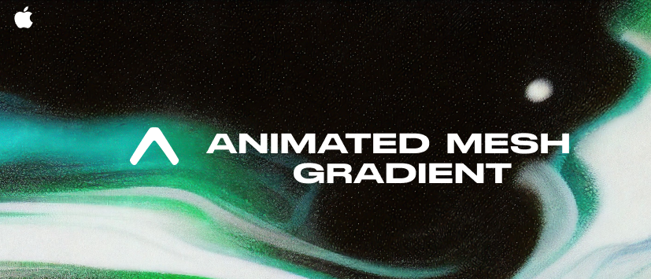

<!-- Banner -->
<p align="center">
  
</p>

<h1 align="center">🎨 expo-ios-mesh-gradient</h1>

<p align="center">
  Beautiful iOS animated mesh gradient made with Expo
</p>

<p align="center">
  
  
  
</p>

<p align="center">
  
</p>

---

## ✨ Features

- 🎨 Beautiful animated **mesh gradients**
- 🌈 **Smooth** color transitions and customizable points
- 🍎 **Native SwiftUI** rendering on iOS
- ⚙️ Fully **configurable animations**
- 🎭 Optional **masking**, safe area ignoring, and more

---

## 🚀 Installation

### 1. Add the package

```bash
npx expo install expo-ios-mesh-gradient
```

### 2. Install CocoaPods

```bash
cd ios && pod install
```

### 3. Prebuild the iOS project (if not already)

```bash
npx expo prebuild --platform ios
```

### 4. Rebuild your application

```bash
pnpm ios
```

> ✅ **iOS only** — This module is built with SwiftUI and works exclusively on iOS.

---

## 📦 Usage

```tsx
import { AnimatedMeshGradient } from "expo-ios-mesh-gradient";

export default function App() {
  return (
    <AnimatedMeshGradient
      columns={3}
      rows={3}
      colors={["#ff6ec4", "#7873f5", "#4ADEDE"]}
      smoothsColors
      animated
      animationSpeed={0.003}
      style={{ flex: 1 }}
    >
      {/* Optional content goes here */}
    </AnimatedMeshGradient>
  );
}
```

---

## ⚙️ Props

| ⚙️ Prop               | 🧾 Type                | 🧮 Default  | 📝 Description                     |
| --------------------- | ---------------------- | ----------- | ---------------------------------- |
| `columns`             | `number`               | `3`         | Number of columns for the mesh     |
| `rows`                | `number`               | `3`         | Number of rows for the mesh        |
| `points`              | `[number, number][]`   | `undefined` | Custom mesh point coordinates      |
| `colors`              | `string[]`             | `[]`        | Colors to render the gradient with |
| `smoothsColors`       | `boolean`              | `false`     | Smooth out color transitions       |
| `ignoresSafeArea`     | `boolean`              | `false`     | Expand mesh into safe area         |
| `mask`                | `boolean`              | `false`     | Enable mask mode                   |
| `animated`            | `boolean`              | `false`     | Enable animation                   |
| `animationSpeed`      | `number`               | `1`         | Controls speed of animation        |
| `animationInterval`   | `number`               | `undefined` | Interval between animations        |
| `noiseAmplitude`      | `number`               | `undefined` | Amplitude of mesh point noise      |
| `frequencyModulation` | `number`               | `undefined` | Modulation frequency for animation |
| `animationRanges`     | `[number, number][]`   | `undefined` | Ranges for point animation         |
| `animationOffsets`    | `number[]`             | `undefined` | Per-point animation offset         |
| `animationScales`     | `number[]`             | `undefined` | Per-point animation scaling factor |
| `style`               | `StyleProp<ViewStyle>` | `undefined` | Custom styles for the wrapper      |
| `children`            | `React.ReactNode`      | `undefined` | Optional child components          |

---

## 📱 Platform Support

- ✅ iOS _(SwiftUI based)_
- ❌ Android _(not supported)_

---

## 🛠 Built With

- ⚛️ [Expo](https://expo.dev/)
- 🍎 [SwiftUI](https://developer.apple.com/xcode/swiftui/)
- 📱 [React Native](https://reactnative.dev/)

---

## ❤️ Contributing

Feel free to open issues, feature requests, or PRs.
All contributions are welcome!

---

## 📄 License

MIT © [rit3zh](https://github.com/rit3zh)
